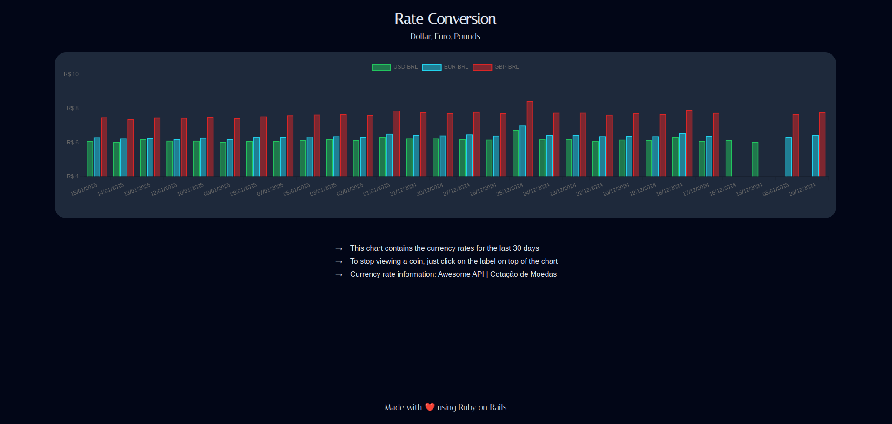

<h1 align="center"> Coin Monitor </h1>

<p align="center">
Coin Monitor is an application that allows to monitor the rate of dollars, euros and pounds to reais for the last 30 days. With an interactive chart and intuitive layout, the user has the rates conversion just a click away!<br/>
</p>

<p align="center">
  <a href="#-technologies">Technologies</a>&nbsp;&nbsp;&nbsp;|&nbsp;&nbsp;&nbsp;
  <a href="#-deploy">Run Locally</a>&nbsp;&nbsp;&nbsp;&nbsp;&nbsp;&nbsp;
</p>

<p align="center">
  
</p>


## 🚀 Technologies
- Ruby
- Rails
- HTML
- CSS
- Javascript
- Chartkick
- API 

## 💻 Run Locally

> To run the project locally you must have `RUBY` and `RAILS` on your computer
* Ruby version used: 3.4.1
* Rails version used: 8.0.1


Steps to run it locally:

1. Clone the Repository

```bash
git clone https://github.com/ssschneider/coin-monitor.git
``` 

2. Run bundler to  ensure all gems are installed

```bash
bundle i
```

3. Start the rails server

```bash
rails s
```

<br/><br/>

---
### Developed by Sarah Schneider 🖖